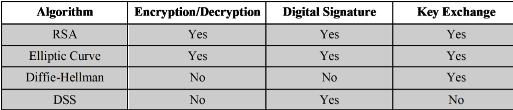

# Asymmetric Crypto

## 一、公钥（非对称）加密介绍
用途：加解密，数字签名，对称加密密钥交换。同样的算法和概念。
常见的非对称加密算法的适用场景：


加密步骤：明文 -> 用接收方的公钥进行加密 -> 密文发送 -> 用接收方的私钥进行解密 -> 明文
元素：公开元素，包括公钥和算法；私有元素，包括私钥。
依据的数学原理：IFP,DLP
## 二、RSA加密
基本概念即非对称加密概念，以及将加密文本看作是一个整数，通常是将2048bits的数看作一个整数。
基本目标是使用两个数作为指数进行模运算求逆运算达到加密和解密的效果。
### 2.1 加解密形式：
```math
C = P^e mod n
P = C^d mod n = (P^e)^d mod n = P^ed mod n
among which C and e are public while d is private
```
### 2.2 密钥生成步骤：
1. 选择两个足够大的p和q，并且要保证p和q是素数。
2. 计算 n = p * q。
3. 计算phi(n)[^1] = (p-1)*(q-1)。
4. 选择e，且要确保GCD(e,phi(n)) = 1（根据域理论，只有这种情况才能确保e在模取算法中有乘法逆），且e∈[1,phi(n)]。
5. 计算 d = e^(-1) mod phi(n)，即为d·e = 1 mod phi(n)。

### 2.3 密钥生成以及加解密举例：
密钥生成：
1. 选择p = 5,q = 11,n = 55。
2. phi(n) = 4*10 = 40。
3. e = 3
4. d = 27

公钥(3,55) 私钥27

加密：
1. m = 13;
2. m^e mod n = 52

解密：
1. 52^27 mod 55 = 13。

### 2.4 工程操作
1. 对于长的文本，可以将文本分组。
2. 为了对付暴力破解，e和d应尽量往高了选。
3. 通常在加密文本的时候需要混合系统，比如通过非对称加密交换对称加密密钥。
4. 最长选的e是65537。

### 2.5 安全分析
1. chosen ciphertext
2. brute-force
3. mathmatical
4. hardware fault-based
5. timing attack

### 2.6 优势
1. 解决了密钥分发的问题。
2. 在多个组织之间只需要每个组合生成两个密钥。

### 2.7 劣势
1. 对于暴力破解比较脆弱。
2. 运算代价高。
3. 运算速度慢。
4. 设备成本高。

## 三、密钥管理
密钥管理用于解决两方面的问题：
1. 公钥的发布问题
2. 使用公钥发布对称加密密钥
### 3.1 公钥发布
常用的公钥发布手段可以分为三种
1. 第一种是通告，这样的方式容易使得双方的通信遭受伪造的攻击形式攻击。
2. 第二种有一个服务器文件夹用于保存当前的公钥，这样的方式也没有完全壁面伪造的攻击形式。
3. 第三种是通过验证机制，主要实现方式是将公钥和发布方的生日注册到CA，通过可信任的CA进行可信公钥的管理。

### 3.2 通过公钥发布对称加密密钥
由于非对称算法（公钥算法）在计算成本和设备成本上都比较大，所以在传输长文本的时候，通信双方更希望通过对称加密算法，实现的方法就是用非对称算法定时的传输对称加密的密钥，成为session key，之后的文件传输过程中文件是通过session key进行对称加解密。

**Diffie-Hellman密钥交换方法：**
这是一个可以建立公共密钥的工具，生成的密钥由通信双方的公钥和共有信息决定，基于Galois Field，安全性基于DLP的难度。

**Diffie-Hellman的过程：**
1. 双方约定一个素数q，计算出素数的原始根α。
2. 双方均选择小于q的私钥，并计算对应的公钥。
3. 公钥即为 Kab=α^(XaXb) mod q。

**举例：**
1. q = 353, α = 3
2. Xa = 91, Xb = 233
3. Ya = 3^97 mod 353 = 40
4. Yb = 3^233 mod 353 = 248
5. Kab = Ya^Xb mod 353 = 40^233 mod 353 = 160
6. Kab = Yb^Xa mod 353 = 248^91 mod 353 = 160

## 四、Hash
给定一个文本m，对应的哈希函数Hash(m)=h是非常容易计算的，但是想要从h计算出m计算能力上是不可行的。因为可能有多个m对应到同一个h值上的，所以逆向的计算是不可行的。基于hash的算法包括MD5,SHA-1,SHA-256 etc。

**用途：**
1. 单向的用户身份加密。
2. 在系统中作为定时的检查工具用于进行入侵检测和病毒检测，判断某段时间中未有人工操作，文本内容有没有改变。
3. 可以作为一个伪随机数生成器。

**安全分析（破解）：**
1. 暴力破解。
2. 争对算法的特征进行分析破解。例如MD5已经被证明可以被破解。
**生日悖论**
在一群数量为n的样本中，随机抽取sqrt(n)个，就有很大的可能抽取到相同的样本。

## 五、高级非对称加密
传统的非对称加密需要一个集中的CA进行管理，而高级非堆成加密取消了CA，取而代之的是PKG进行管理，需要通信方用自己的独有信息进行验证。
## 5.1 IBE（Identity-Based Encryption）
过程：
1. PKG 生成一个公钥和私钥。
2. 用户到PKG 提交自己的身份特征，PKG用自己的私钥和用户的特征生成用户的私钥。
3. 发送发使用PKG的公钥和接收方的特征将明文生成密文。
4. 接收方（拥有正确的身份信息）通过PKG分配的密钥进行密文的解密。

## 5.2 ABE(Attribute-Based Encryption)
与IBE类似，用户用自己的属性特征进行加密。

特征：
1. 适用于大数据。
2. 一对多加密。
3. 加解密的复杂度和铭文密文的数量是独立于用户属性特征之外的。

[^1]: phi 即为数论当中的 ∮。