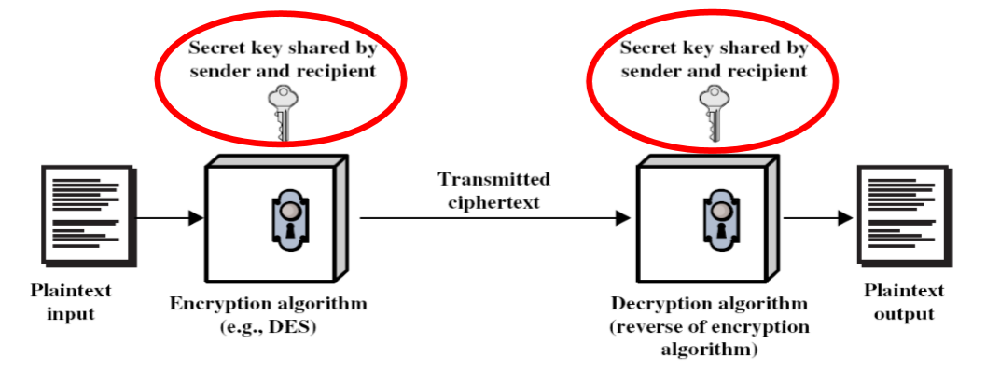
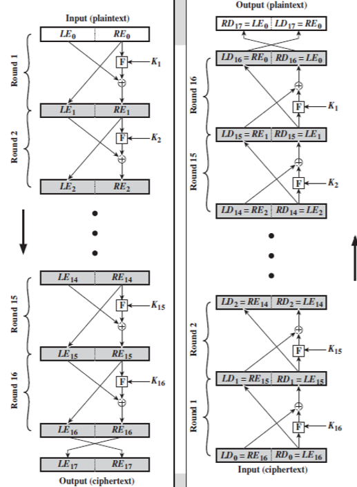
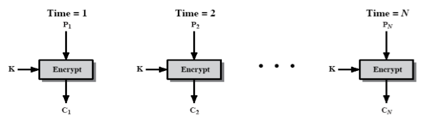
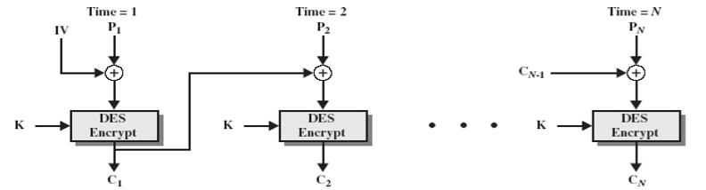
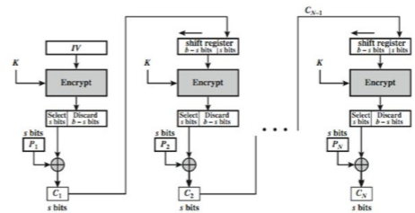
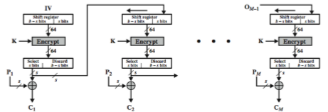
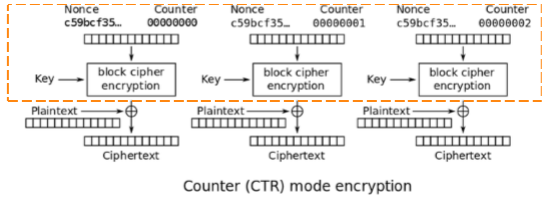

# Symmetric Crypto
## 一、对称加密的基本过程
### 1.1 对称加密的五个要素
* 明文
* 密钥
* 加密算法
* 密文
* 解密算法
### 1.2 对称加密模型
通讯双方共享密钥，加密方运行加密算法，解密方运行对应的解密算法，文本信息在传输过程中以密文的形式存在。
在已知加解密算法的前提下，这个模型可以通过平均50%的尝试次数进行暴力破解。


### 1.3 对称加密的原则
1. 通过密钥发布中心（KDC:Key Distribution Center）共享同一个密钥。
2. C = E(k,P); P = D(C,k)。
3. 没有密钥无法正常对文本信息进行解密。

# 二、对称加密的算法类型
对称加密包括流加密（stream cipher）和组加密（block cipher），两者没有完全意义上的割裂。组加密是指将文本信息分割成均等大小的N组，并分别对各个组进行加密。所谓流加密通常指将文本信息看作一个有先后次序的数据流，在分组的基础上，往往前一组的结果或者计算过程中的某个量会对后一组造成影响。
## 2.1 流加密
### 2.1.1 概念
将需要加密的文本内容看作是一个有序的数据流，通过持续的加密‘输入内容’得到‘输出内容’。对应到传统加密的One-Time Pad 方式，从而实现理论上的安全。
### 2.1.2 加密过程
1. 通过种子seed（IV）生成足够长（通常是与文本内容一样长）的伪随机密钥（类似于One-Time Pad）。
```math
K = KSG(seed, IV)
```

2. 将密钥与明文文本进行异或。
```math
C = P⊕K
```
3. 双方沟通seed 和 KSG。

### 2.1.3 特征
1. Keystream 没有重复的模式，且统计意义上是安全的。
2. seed需要足够长且足够随机。
3. KSG需要很难被逆向。
4. 复杂度是线性的，与seed长度相比。

### 2.1.4 RC4加密
使用场景：webSS/TLS, wireless WEP。
过程即为流加密过程。
安全隐患：使用的是相同的KSG，那么多次的传输过程中，如果使用的是相同的seed，那么也将会生成相同的Keystream。

## 2.2 组加密
组加密将需要被加密的文本切分成不同的组，分别对这些组进行加密。
### 2.2.1 范式 - Feistel结构
1. 将文本组分为左右两个部分L & R。
2. 首先将R与密钥进行对应的操作。
3. 然后将操作后的R与L进行异或生成R’。
4. 之后将R本身作为L’放置在R’的左侧。


从以上的结构中可知，这种结构的变量主要有key，F，split(block)，round。
### 2.2.2 DES加密
对于Feistel中的主要变量，DES有对应的定义。
Key由56bits构成，block由64bits构成，循环次数是16次，F包括S-Box和P-Box。
破解方法：
1. 由于密钥的长度和分组的长度都比较短，现在的计算机就有暴力破解的可行性。
2. 差分破解。
3. 线性破解。
### 2.2.3 基于DES的加密方法
1. 3DES：先用密钥1进行加密，再用密钥2进行解密，最后用密钥3进行加密。
2. IDEA：加长了密钥的长度至128bits，在PGP中使用较多。
3. Blowfish：加长了密钥的长度至128~448bits，并且增加了round的次数至16次。
4. RC5：有快速简洁、软硬件适用、变长密钥、高安全性等优点。
### 2.2.3 AES
相对于DES，AES增加了block的长度至128bits，并且提供了可选的key的长度，包括128bits，192bits，256bits，对应的循环次数为10次，12次，14次。
组的初始状态为4*4的字节数组排列，密钥被延长至32bits的数组。除了第一次循环，其余循环包括五种状态：1. byte substitution，2. shift row，3. mix columns，4. add round key，5. view the whole operation as alternating。

## 三、对称加密的五种模式
根据NIST SP 800-38A规定，对称加密的五种模式包括ECB，CBC，CFB，OFB，CTR。
### 3.1 ECB（Electronic Codebook）
1. 首先将需要加密的文本延长至密钥的整数倍。
2. 将文本分组并挨个与密钥进行异或。
3. 将异或后的文本拼接起来形成密文。
特征：虽然使用相同的key，但组与组之间互不干扰，某一组发生了错误不会传染。
劣势：同样的文本会加密依然生成同样的文本，从而文本中的部分模式就被保存了下来。


### 3.2 CBC（Cipher Block Chaining）
1. 组与IV进行异或。
2. 与密钥进行相应操作生成第一组的密文block。
3. 将前一组的block作为下一组的IV进行循环。
特点：重复的文本不会再生成同样的重复密文，有效的破坏了文本中的模式。
劣势：互相依赖，错误具有传染性，如果某一组丢失，那么下一组无法正确的解读。


### 3.3 CFB（Cipher feedback）
有很多可选的参数 CFB-1,CFB-8,CFB-64...，其中的数字分别代表一个组的大小s。
1. IV与密钥进行相对应操作得到一个IV’。
2. 选择左边的s个bit与明文中的s个bit进行异或。
3. 将得到的大小为s的密文作为下一组的IV的一个参数。
用途：流数据加密；身份认证。


### 3.4 OFB（Output feedback）
与CFB类似，但并没有将密文作为下一组IV的参数，而是将IV和密钥生成的IV'中的左边s个bit作为下一组IV的参数。
用途：嘈杂网络中的流加密。


### 3.5 CTR（Counter）
1. 分组。
2. 对于每一组生成一个随机数N。
3. 将每一组的随机数与密钥进行操作生成N'。
4. 将N'与明文进行异或得到密文。
优点：速度快，效率高，可以并行计算，随机数能够保证安全。
缺点：随机数的生成需要是尽量随机且每一个组不能相同，需要维护大量的随机数。
用途：高速网络的加密。

