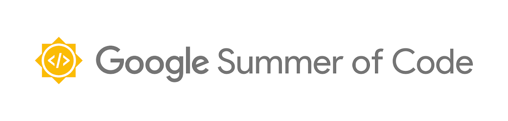

# Fitbit Web API Subscription and Nutrition API Extension


## GSoC'22  - Final Project Report

Hi, I'm Junjie Zhou. I am a developer of RADAR-Base GSoC2022. The following report summarizes the work done during Google Summer of Code 2022 along with future work. 


## Basic Info
- Mentor: Yatharth Ranjan
- Student: Junjie Zhou
- Organization: [RADAR-Base](https://radar-base.org/)
- Project Title: Fitbit Web API Subscription and Nutrition API Extension

## Project Goals and PR Links


The goal of this project is to enrich the ability of RADAR-Base when interacting with third-party, specificlly Fitbit, data provider. And it could be split into three parts according to three works that has been done: update hr and sleep api, add nutrition api, integrate Fitbit subscription API.

- ✔(merged) [#RADAR-REST-Connector/pull/92](https://github.com/RADAR-base/RADAR-REST-Connector/pull/92): Update current Web API(heart-rate-related and sleep related) requests.
- ✔(merged) [#RADAR-Schemas/pull/315](https://github.com/RADAR-base/RADAR-Schemas/pull/315): Add another Web API(nutrition) request for Kafka.  
- ⊙(unmerged) [#RADAR-PushEndpoint/pull/52(unmerged)](https://github.com/RADAR-base/RADAR-PushEndpoint/pull/52): Integrate a Fitbit subscription API to ```RADAR-REST-Connector```(moved to ```RADAR-PushEndpoint```) so that it can retrieve data when necessary.

## Actions
### Update hr and sleep api
For updating current API: schema and logic code shoule be modified. And I have updated such logic code with newly generated schema classes, together with some other configurations and route logic. Moreover, such modifications has been partially moved to repo ```RADAR-PushEndpoint``` with the help of mentor Yatharth.

### Add nutrition api
For adding nutrition’s API: schema, converter and route should be added. And I have added such schema in repo ```RADAR-Schemas``` and added such converter and route in repo ```RADAR-PushEndpoint```.

### Integrate Fitbit subscription api
For Fitbit subscription integrating. We experience a migration from project ```RADAR-REST-CONNECTOR``` to project ```RADAR-PushEndpoint``` because the latter is more suitable to handle with such task topologically. 

Originally, the newly data flow after integrating subscription is exemplified as the following figure. In such a way, we need open another interface to receive notifications and handle them.


However, similar updating notifications also applied to interaction with data provider Garmin, which is implemented in ```RADAR-PushEndpoint```. So we migrate the interation with Fitbit to that project. The inner logic of it is exemplified as the following figure.


From above figure, we can split such integration into three procedures.
- Creating Subscriptions: Subscriptions are requested to Fitbit for each user through subscription-related service the moment endpoint is startup. Fitbit then return whether subscriptions are successfully created for each user. For successful requests, we store the user and status in memory. For failed requests, we try that again after configured duration.
- Listening Notifications: An endpoint is started to listening requests, which are notifications of data updation for users, from Fitbit. When a notification is coming, notification-related service processes it and stores the latestOffset into redis according to user and data scope.
- Retrieve Data: We implement a request processor to periodically read offset updation from redis according to user and data scope. If latestOffset is different from lastSuccessOffset, the processor will retrieve such data from Fitbit. Then the retruned result is converted to what we need(defined in ```RADAR-Schemas```) and sent to Kafka so that could be used in a real-time way by downstream apps.

## Testing Result
The unit test is passing. But we still need to test in the production enviroment whether the subscription could be successfully created and notifications could be received successfully.

## What's left
- Testing in the Internet
- Getting the PR merged
- Future contributions(codes/docs/...):
    - Create libraries for submodules such as converters, route and request generation so the code can be reused across both the ```RADAR-REST-CONNECTOR``` and the ```RADAR-PushEndpoint```
    - Contribute docs on projects from RADAR-Base and relationships between them.
    - ...

## Discussions
During the program, regular meetings hosted through Google Meet, Teams or Slack huddle are the primary mode of communication between me and the mentor. Also, RADAR-Base slack workspace is mostly used to resolve any doubts, suggestions and comments.

- First Meeting
    - Date: 27 May 2022
    - Related GSoC Timeline: Community Bonding
    - Participants: Yatharth, Junjie,
    - Agenda：
        - The first is self-introduction.
        - Second, questions concerning setting up the development environment.
            - Do I need a Fitbit user account with real data?
            - What is the management portal used for? Do I need it?
            - What is the push endpoint used for? Do I need it?
            - Could I take a look at the normal logs?
            - Nutrition and Subscription, which one has a higher priority?
        - Third, available time.
    - Actions:
        - First, run the containers correctly.
        - Second, check the data flow among different containers and have a clear mind on what part in the data flow I should update.
        - Third, work on the subscription task: make designs, codes, and tests.


- Second Meeting
    - Date: 4 Jul 2022
    - Related GSoC Timeline: Fourth Week
    - Participants: Yatharth, Junjie,
    - Agenda：
        - Current Work
            - Running the docker containers successfully.
            - Learn Kotlin Fundamentals.
            - Get familiar with the project structure.
            - Fitbit subscription design.
            - Encountering Problems
            - Kotlin
            - Project-related building problems
    - Next Plan
        - Complete Fitbit subscription design under the architecture of PushEndPoint. – Take a look at the Extending section on PushEndpoint README.
        - Separate Convertor module.
        - Report any persistent issues with the build and make a PR if the solution is found
    - Subscription Difference between Garmin and Fitbit
        - Garmin: automatically sends data after authorization; Fitbit: will not automatically send data after authorization, need the first request to start the subscription
        - Garmin sends complete data into PushEndpoint, Fitbit only sends notifications (from which we have to pull the data using callback URLs provided in the notification).

- Third Meeting
    - Date: 18 Jul 2022
    - Related GSoC Timeline: Sixth Week
    - Participants: Yatharth, Junjie
    - Agenda:
        - Diagram
        - Jersey-related Code
    - Next Plan:
        - Modify the diagram
        - coding

- Fourth Meeting
    - Date: 25 Jul 2022
    - Related GSoC Timeline: Seventh Week
    - Participants: Yatharth, Junjie
    - Agenda:
        - Mid-term evaluation
    - Next Plan:
        - Todos

- Fifth Meeting
    - Date: 1 Aug 2022
    - Related GSoC Timeline: Eighth Week
    - Participants: Yatharth, Junjie
    - Agenda:
        - Fitbit subscription issue
        - Management Portal issue
    - Next Plan:
        - Coding

- Sixth Meeting
    - Date: 5 Sept 2022
    - Related GSoC Timeline: Eighth Week
    - Participants: Yatharth, Junjie
    - Agenda:
        - Subscription and request too many request exceptions
        - Code review
        - Next plan
    - Next Plan:
        - Add timestamp for next request. The request limit is for each user.
        - Remove sensitive configurations from gateway.yml
        Implement Redis to store a map of each notification and create a service periodically to get notifications from Redis.

- Fitbit Gsoc (27th Sept)
    - Copied some code from fitbit connector
    - Setting up service (resource) for fitbit endpoints
    - Redis no updates
    - Questions:
        - FItbit subscription api only supports activity, body, nutrition and sleep  — https://dev.fitbit.com/build/reference/web-api/developer-guide/using-subscriptions/#Collection-Types 
        - Kind of defeats the purpose of us migrating — we needed mostly for continuous data 
        - YR: discuss internally and contact fitbit to double check (might be there is a way to access that)
    - Subscriber security — https://dev.fitbit.com/build/reference/web-api/developer-guide/best-practices/#Subscriber-Security 
    - Redis FIFO queueing for incoming notifications
    - RequestGenerator — query these and only delete from FIFO queue when the processing is complete (or put back if processing fails) 


- Fitbit Gsoc (14th Oct)
    - Work done
        - was busy
        - Not much updates
    - Questions
        - Missing notification handling
    - Next Steps
        - Redis storage of notificaitons
        - Notification processing code — read offsets from redis, read new notification from redis, pull all the data between the two dates
        - Storing offsets after success requests


- Fitbit Gsoc (17th oct)
    - Work done
        - Redis only store offset from notifications
        - Store lastSuccessOffset and latestOffset in redis
        - Processing code for service to process the data
        - Had a quick peer coding session to iron out the kinks.
    - Questions
        - On redis persistence
        - Request generation
    - Next Steps
        - Implementing the request generator
        - Separate request generation and adding to redis
        - Copy the request generation code from the rest-connector and modify for push endpoint (use redis for offsets,etc)


- Fitbit Gsoc (24th oct)
    - Work done
        - Completely the redis part
    - Questions
        - A problem with redis when working
        - Encapsulate offsets as there are 2 offsets
    - Next Steps
        - Redis storage of notificaitons
        - Notification processing code — read offsets from redis, read new notification from redis, pull all the data between the two dates
        - Storing offsets after success requests 

- Meetings without formal notes.