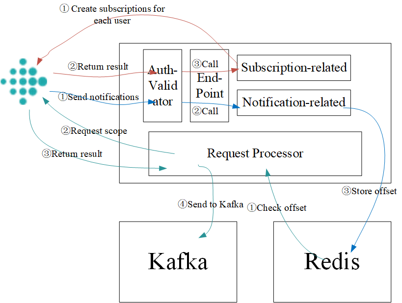

# Fitbit Web API Subscription and Nutrition API Extension

**Student**: Junjie Zhou

**Mentor**: Yatharth Ranjan

Links to accomplished work:
- Update current Web API(heart-rate-related and sleep related) requests: [RADAR-REST-Connector/pull/92(merged)](https://github.com/RADAR-base/RADAR-REST-Connector/pull/92)
- Add another Web API(nutrition) request for Kafka:  [RADAR-Schemas/pull/315(merged)](https://github.com/RADAR-base/RADAR-Schemas/pull/315)
- Integrate a Fitbit subscription API to ```RADAR-REST-Connector```(moved to ```RADAR-PushEndpoint```) so that it can retrieve data when necessary: [RADAR-PushEndpoint/pull/52(unmerged)](https://github.com/RADAR-base/RADAR-PushEndpoint/pull/52)

## Introduction

Hi, I'm Junjie Zhou. I am a developer of RADAR-Base GSoC2022. The goal of this project is to enrich the ability of RADAR-Base when interacting with third-party, specificlly Fitbit, data provider. My work could be split into three parts according to three works that has been done: update hr and sleep api, add nutrition api, integrate Fitbit subscription API.

## Actions
### Update hr and sleep api
For updating current API: schema and logic code shoule be modified. And I have updated such logic code with newly generated schema classes, together with some other configurations and route logic. Moreover, such modifications has been partially moved to repo ```RADAR-PushEndpoint``` with the help of mentor Yatharth.

### Add nutrition api
For adding nutrition’s API: schema, converter and route should be added. And I have added such schema in repo ```RADAR-Schemas``` and added such converter and route in repo ```RADAR-PushEndpoint```.

### Integrate Fitbit subscription api
For Fitbit subscription integrating. The newly data flow after integrating subscription is exemplified as the following figure.


More specific, such notification dealing has been moved to ```RADAR-PushEndpoint```. The coding part is done with the help of mentor Yatharth, and the inner logic of it is exemplified as the following figure.


## Testing Result
To be updated...

## What's left
- Testing in the Internet
- Getting the PR merged
- Future contributions(codes/docss/...)

## Discussions

- First Meeting
    - Date: 27 May 2022
    - Related GSoC Timeline: Community Bonding
    - Participants: Yatharth, Junjie,
    - Agenda：
        - The first is self-introduction.
        - Second, questions concerning setting up the development environment.
            - Do I need a Fitbit user account with real data?
            - What is the management portal used for? Do I need it?
            - What is the push endpoint used for? Do I need it?
            - Could I take a look at the normal logs?
            - Nutrition and Subscription, which one has a higher priority?
        - Third, available time.
    - Actions:
        - First, run the containers correctly.
        - Second, check the data flow among different containers and have a clear mind on what part in the data flow I should update.
        - Third, work on the subscription task: make designs, codes, and tests.


- Second Meeting
    - Date: 4 Jul 2022
    - Related GSoC Timeline: Fourth Week
    - Participants: Yatharth, Junjie,
    - Agenda：
        - Current Work
            - Running the docker containers successfully.
            - Learn Kotlin Fundamentals.
            - Get familiar with the project structure.
            - Fitbit subscription design.
            - Encountering Problems
            - Kotlin
            - Project-related building problems
    - Next Plan
        - Complete Fitbit subscription design under the architecture of PushEndPoint. – Take a look at the Extending section on PushEndpoint README.
        - Separate Convertor module.
        - Report any persistent issues with the build and make a PR if the solution is found
    - Subscription Difference between Garmin and Fitbit
        - Garmin: automatically sends data after authorization; Fitbit: will not automatically send data after authorization, need the first request to start the subscription
        - Garmin sends complete data into PushEndpoint, Fitbit only sends notifications (from which we have to pull the data using callback URLs provided in the notification).

- Third Meeting
    - Date: 18 Jul 2022
    - Related GSoC Timeline: Sixth Week
    - Participants: Yatharth, Junjie
    - Agenda:
        - Diagram
        - Jersey-related Code
    - Next Plan:
        - Modify the diagram
        - coding

- Fourth Meeting
    - Date: 25 Jul 2022
    - Related GSoC Timeline: Seventh Week
    - Participants: Yatharth, Junjie
    - Agenda:
        - Mid-term evaluation
    - Next Plan:
        - Todos

- Fifth Meeting
    - Date: 1 Aug 2022
    - Related GSoC Timeline: Eighth Week
    - Participants: Yatharth, Junjie
    - Agenda:
        - Fitbit subscription issue
        - Management Portal issue
    - Next Plan:
        - Coding

- Sixth Meeting
    - Date: 5 Sept 2022
    - Related GSoC Timeline: Eighth Week
    - Participants: Yatharth, Junjie
    - Agenda:
        - Subscription and request too many request exceptions
        - Code review
        - Next plan
    - Next Plan:
        - Add timestamp for next request. The request limit is for each user.
        - Remove sensitive configurations from gateway.yml
        Implement Redis to store a map of each notification and create a service periodically to get notifications from Redis.

- Meetings without formal notes.