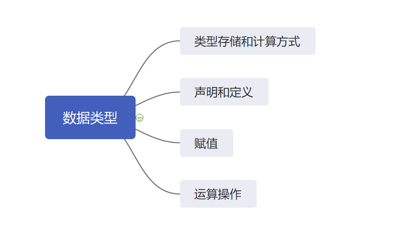
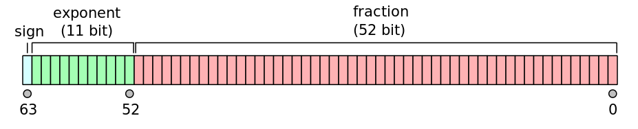

# Fundamental Data Type
## 1. 基本数据类型
Java使用了八种基本数据类型，这八种基本数据类型可以满足大多数使用数据的情况。根据占用不同的内存长度，八种数据类型可以分为五组，如下表。

占用字节长度 | 不确定 | 1个字节 | 2个字节 | 4个字节 | 8个字节
--- | --- | --- | --- | --- | --- 
基本数据类型 | boolean | byte | short char | int float | long double

在对这八个基本数据类型进行介绍的时候将使用下图的结构。
- 类型存储和计算方式尝试从硬件系统结构的角度解释某个基本数据类型，包括占用内存的大小形式以及常见计算的执行过程。
- 声明和定义提供了使用该数据类型的方法，包括声明、定义、初始化赋值、默认值。
- 赋值本身有多种方式，也包括多个注意事项，例如进制安排，不同类型之间的转化，以及赋值时的可读性。
- 运算操作指代了基本数据类型作为参数可以参与哪些运算，与计算方式不同在于这一部分只介绍运算的输入输出，将不再介绍中间过程。

这么安排的原因如下：
- 计算机系统是分层次的，处在第n层的人，通常要了解第n-1层提供的服务；而类型存储和计算方式这一部分作为第n-1层的内容，有利于深刻了解第n层的输入和输出原理。同时有利于回答基本数据类型“是什么”。
- 除此之外，使用声明定义赋值运算具体阐述“怎么做”，介绍数据类型如何被利用，以及在利用的过程当中有什么技巧。




## 2. boolean
boolean又称布尔类型，只有两种表现形式。

### 2.1 类型存储和计算方式
boolean代表了true/false，但在Java中并没有限制实现手段，根据不同的jvm实现可能会有不同内存占用。在使用boolean数组的时候会有区别。

boolean的计算方法与存储方式有紧密的关系。假设以一个bit作为一个boolean，那么计算方法就包括获取bit、存储bit、运算bit、并得到结果bit。

### 2.2 声明和定义
声明方法如下：
```java
boolean a = true;
```

- 在Java中，boolean只可以通过true/false进行赋值，否则就会报错。因为没有限制实现手段，所有就无法使用一个bit或是一个byte决定值。
例如：这种情况会报错，无法将byte转为boolean
```java
byte aByte = 0b1;
boolean aBoolean = (boolean) aByte;
```
- 如果不进行显式得赋值，boolean变量默认为false（某个方法内部的本地变量不会赋默认值）。
- 变量命名的时候命名为XXX而非isXXX，因为boolean变量在pojo中的getter就是以isXXX形式存在的。

### 2.3 赋值
赋值包括进制，类型与类型之间的转化，以及内容的可读性。
- 在进制方面，由于boolean使用true/false，所以不涉及bin/oct/dec/hex。
- boolean也无法与其他基本数据类型进行强制转化。
- 由于只是true/false，所以可读性方面也比较直接。

### 2.4 运算操作

boolean数据类型拥有四种运算方式，如下表格

运算 | 非 | 与 | 或 | 异或
--- | --- | --- | --- | ---
符号 | !a | a & b | a \| b | a ⊕ b  
示例 | !true = false | true & false = false | true \| false = true | true ⊕ false = true


### *一点小思考*
最早的体现是计算机结构中高低电平的0与1，在程序中，经常会出现判断结构，对两者进行判断某一属性是否相同的行为，判断结果决定这程序的走向，此时真与假就很简单的表示了两种走向。可以说是一种特殊的分支结构。

## 3. byte short int long
这四种类型都可以看做是整数类型，区别在于表示范围不同，给定一个n个bit（8*#ofbyte）的整数类型，可以表示的范围为[-2^n~2^n-1]。

在Java的基本数据类型中，这四种类型默认是有符号的，所以表示范围包括负数和正数。当然也可以将这些类型看作是无符号整数，Java也支持无符号的运算操作。

### 3.1 类型存储和计算方式

根据上文的表格可以很清晰的看出不同的整数类型占用了不同的字节，这也是决定某个类型表示范围的因素。每个字节包含8个bits，其中每个bits有两种状态0或1。

存储结构中，不会有特殊的符号标识正负号。但是在运算过程中，Java将第一个bit当作符号位，0表示正数，1表示负数，从而在运算过程中整数类型就作为有符号数进行运算。

并且在存储结构中，数据是以补码的形式存在，正数的补码是数据本身，负数的补码是除符号位取反+1。之所以采用补码，是为了在硬件上运算方便。

源码和补码的关系可以进行如下的理解：
- 以byte类型为例，将数字从小到大排列，就是-128，-127...127。
- 源码就是数字本身
- 补码就是符号位加上每个数字的索引就是10000000，10000001...

下面通过byte进行举例，其他类型除了占用内存长度不同，其他性质都相同。

正数123表示为：
0 | 1 | 1 | 1 | 1 | 0 | 1 | 1
--- | --- | --- | --- | --- | --- | --- | --- 

负数-57补码表示为：

1 | 1 | 0 | 0 | 0 | 1 | 1 | 1
--- | --- | --- | --- | --- | --- | --- | --- 

基本的计算方法就是加减乘除，其中减法其实是转化为加法，通过减数加上被减数的相反数实现。

- 加法：按位相加，与十进制相同的进位法则
- 减法：转化为加法，通过减数加上被减数的相反数实现
- 乘法：符号位进行异或，其他位进行与十进制相同的乘法运算
- 除法：符号位进行异或，其他位进行与十进制相同的乘法运算

### 3.2 声明和定义
声明方法如下:
```java
byte aByte = 2;
short aShort = 2;
int aInt = 2;
long aLong = 2L;
```
- 整数类型在进行初始化赋值的时候正常赋值即可，唯一需要注意的是，Java中任意一个常数都是先转化为int，再判断是都在变量类型可表示的范围里，再进行自动的赋值。除非在常数末尾加上L，加上L表示直接转化为long型常数。
- 末尾的L也不是非得加，由下文可知其他类型可以自动转化为long型，但是就多出了转化的步骤。
- 所有的变量在不进行初始化赋值的情况下，默认值为0，（某个方法内部的本地变量不会赋默认值）
- 变量命名规则依照Java规约即可

### 3.3 赋值
与boolean相同，赋值包括进制，类型之间的转化，以及内容的可读性。
进制 | bin | oct | dec | hex
--- | --- | --- | --- | ---
前缀 | 0b | 0 | 1~9 | 0x
- 进制上，任何一种正数类型都可以指定bin/oct/dec/hex，不同的进制通过不同的前缀区分。具体的前缀代号如上文表格。不管使用何种进制，在给long型变量赋值的时候都需要在常数尾添上L。
- 类型之间的自动转化，只能由低向高转化（高指代表示范围大的类型，低指代表示范围小的类型），由高向低转化需要进行强制转化，强制转化的代码如下。强转的过程就是从高类型右侧开始直接截取与低类型大小相同的字节作为低类型常量，显然有可能并不代表原来的数据。
```java
high aHigh = xxx;
low aLow = (Low)aHigh;
```
- 为了使得长数据可读性更高，Java可以在用于赋值的常数中间插入下划线“\_”，但是不能在前缀部分或者后缀(L)部分插入，例如使用0b前缀的时候将没四位二进制位区分开来，常数就可以写成0b0101\_0101\_0101\_0101\_0101\_0101\_0101\_0101。

### 3.4 运算操作
与计算方式不同，运算操作包括可以进行的运算，以及运算的性质。
- byte short int 类型在计算的时候都先转化为int，然后再进行计算，这也就导致一下的代码会出现注释中的错误。
```java
byte aByte = 12;
byte bByte = aByte + aByte;
//Type mismatch: cannot convert from int to byte
```
- 在计算乘法的时候，如果结果溢出（超过int能表示的范围），那么将截取最后32位作为结果。long类型同理，在大数进行计算的时候，使用BigInteger封装类进行计算。
- 在计算除法的时候，整数与整数的除法只能整除

除了加减乘除运算，整型数据还有左移(<<)，右移(>>)，无符号右移(>>>)
- 左移，所有位依次向左移，右边补0
- 右移，所有位依次向右移，左边补与原符号位相同的数字
- 无符号右移，所有位依次向右移，左边补0。无符号右移就是为了应对无符号类型的运算，例如涉及IP地址的运算。

### *一点小思考*
看以下两个赋值方式，第一位为符号位，另外7位为数字为
```java
byte aByte = 0b0101_0101;
byte bByte = 0b1010_1010;
```
如果用这样的方式赋值，```bByte```会报```type mismatch```错误，为什么呢？

因为Java中所有的常数都是先转化为int类型，再判断值是否在声明的变量可表示的范围内。那么0b1010_1010其实表示的数值是0b0000_0000_0000_0000_0000_0000_1010_1010，显然不在bByte可表示的范围内，所以在转化的时候会产生异常。并非想当然的将第一个bit看作符号位。


## 4. float double
### 4.1 类型存储和计算方式
参照IEEE 754-2019标准，可以看出浮点类型小数在计算机程序中的存储方式。下面两幅图分别表示了，float和double类型的标准。


以float进行举例，sign为符号位，exponent为指数位或者阶位，fraction为尾数位，计算方式为(sign&1)1.fraction*2^(exponent-127)

浮点数的加减分为五个步骤
- 对阶，小阶向大阶对齐
- 尾数加减
- 规格化处理
- 舍入操作
- 判断结果的正确性，是否溢出

浮点数的乘除分为两个步骤
- 阶码运算，乘-阶码求和，除-阶码求差
- 浮点数的尾数乘除法以及舍入处理


### 4.2 声明和定义
声明方法如下：
```java
float aFloat = 1.23F;
double aDouble = 1.23D;
```
默认值float为0.0F，double为0.0D，（某个方法内部的本地变量不会赋默认值）

### 4.3 赋值
- 与其他数值类型不同，浮点数只能通过十进制进行赋值
- int char short byte类型可以强转为float，但是强转之后的结果与原结果相同，但当int类型数值形式为0b01xx_xxxx_xxxx_xxxx_xxxx_xxxx_x01x_xxxx时会出现精度缺失，因为float的尾数只能表示24个bit（包括小数点前一位）所以从这一位开始会被舍去。在Java中，这一位舍去的方法是舍0进1，感兴趣的可以参照[IEEE 754](#https://en.wikipedia.org/wiki/IEEE_754#2019)。
- double类型与float类型同理。

### 4.4 运算操作
除了常规的加减乘除，浮点数不可以进行左移右移等操作。

## 5. char
### 5.1 类型存储和计算方式
char类型用两个字节存储，代表了单个字符，总共可以表示65535个字符。
虽然char类型只用来指代字符，但也可以进行计算，计算得到的数字则表示该数值指代的字符。
### 5.2 声明和定义
声明方法如下：
```java
char aChar='A';
```
- char类型在初始化赋值时可以使用单引号+字符的形式
- 默认值为```'\u0000'```，（某个方法内部的本地变量不会赋默认值）
- 变量命名也是依照Java规约
### 5.3 赋值
- char类型赋值形式可以使用单引号+字符
- 还可以使用字符代码```\uxxxx```
- 还可以直接使用数字```xxx```
### 5.4 运算操作
所有整数可以进行的操作，char类型都可以适用，如下的例子，使用后的结果代表了结果指代的值。
```java
char aChar='\u00ED';
aChar = (char) (aChar + 1);
```
