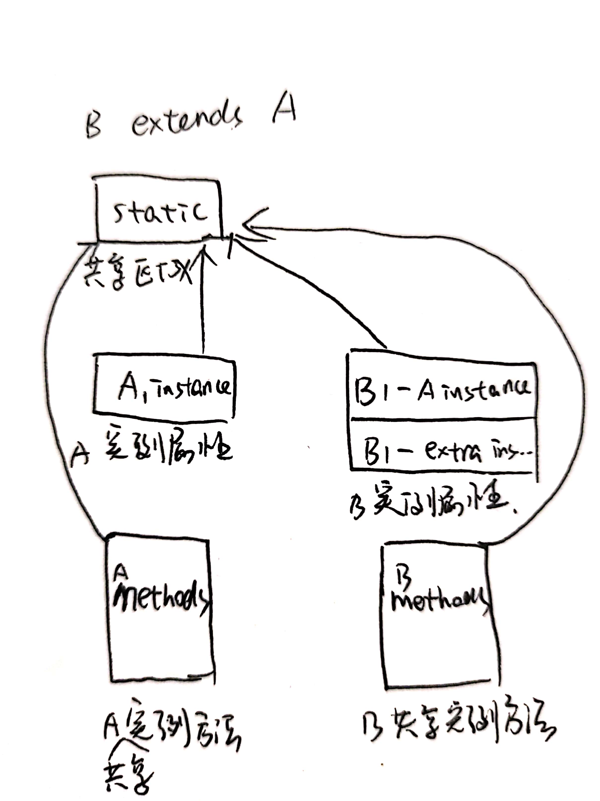

# Object Oriented
## 1. 思想 -> 类
在我的理解中，编程语言的发展经历了几个简要阶段。最初的0101的出现是为了让计算机能够根据电路特征快速的执行一个运算任务；为了不用每次都进行0101的设置，计算机工作者整合不同电路特征的功能作为指令出现了汇编语言，使得每次给计算机下达任务更快；程序越来越大使得用指令编写也变得繁琐，高级编程语言应运而生，拥有着更符合人思维方式的语言特征，减轻了对底层硬件深入理解的负担。

面向对象的语言就属于高级编程语言的一种，背后的思维方式是对物质本身进行抽象定义。自然世界是由物体构成的，人是一个物体，电脑是一个物体，甚至空气也是以气体形式存在的物体。面向对象也是这样，程序是用代码抽象表示的物体，也由其他抽象物体所构成。

在编写面向对象程序的时候，程序员充当着自然世界“上帝”的角色，可以随意创造物体。从这个角度出发，当我们需要某样（抽象的）物体的时候创造一个就行了，需要一台电脑造一个，需要桌子造一个，需要一个女朋友造一个... 前提是有这个物体的模板或者是蓝图。

创造的前提是有这个物体的模板或者蓝图，所以在创造之前还需要设计物体的蓝图。创造一个物体需要回答三个问题，是什么为什么怎么做。既然程序代表的是抽象的物体，那也需要回答这三个问题。关于是什么，物体可以概括为特征和功能；“为什么要设计”是由实际生产中的需求决定的，在学习的时候往往不需要理由；关于怎么做，程序员需要利用编程语言提供的语法完成“是什么”中约定的特征和功能。

针对同一类物种，一个模板或者蓝图就足够了。例如，普通人与普通人之间，区别在于身高，性别，年龄等等，但是每个人都有身高，性别，年龄等特征。

对应到Java中，设计蓝图即为编写类，创造物体即为根据类创建实例。

## 2. 类的蓝图
从创造抽象物体的思想中已经可以看出，类就代表了抽象物体的蓝图。那么类具体要怎么设计？从对“是什么”的回答中能看出类需要特征和功能。
```Note:特征、属性、变量，代表的是同样的意思，功能、方法、函数也是一个意思。```

### 2.1 声明类
打开记事本，写下如下的代码，就创建了一个名称是OneClass的类，这是类最简单的形式。
```java
class OneClass{

}
```
除此之外，类还有**修饰符**，**继承**，**实现接口**。

修饰符用于指定类的可获取性，包括public，private， protected，*package-private*，final。

A类可以继承也可以被继承，相对于被继承的类，A类是子类，相对于继承A类的类，A类是父类。同时，谈到继承就要谈到共性和特性，如果此时C类也继承A类，那么A类中的特征和功能就是B和C所共有的，但B和C又有各自的特性。例如，汽车继承车，自行车也继承车，汽车和自行车所共有的是速度、轮胎等等，但是汽车特有油门，自行车特有脚踏。至于如何规定类与类之间的继承关系，那就要看业务的粒度需求了。实例代码如下，之所以不用把```Vehicle```中的功能在```Car```中写出来，是因为已经隐式的继承过来了。
```Java
class Vehicle{
    void forward(){}
    void back(){}
}

class Car extends Vehicle{
}
```
在内存当中，继承的编排如下图


接口就是功能，或者说规定了类需要实现的功能。再拿汽车来举例子，汽车继承自车，那么车的前进后退功能肯定也是继承过来了。但是现在出现了一个飞行汽车，那这到底是继承汽车还是继承飞机呢？这种情况，可以规定一个飞行功能的接口，使用汽车实现这个接口，那么飞行的功能汽车也有了。问题又来了，现在出现一个水陆空三栖的车咋办？再实现一个游泳的接口就可以啦。实例代码如下：
```Java
interface AirPlane{
    void fly();
}

interface Boat{
    void swim();
}

class Vehicle{
    void forward(){}
    void back(){}
}

class Car extends Vehicle implements AirPlane, Boat{
    fly(){
        //todo
    }
    swim(){
        //todo
    }
}
```

### 2.2 定义类的属性--变量
类声明好了，也就是蓝图的框架搭好了，就该开始搭建“是什么”的内容了，首先就是类的变量，也叫特征、属性等。
类的变量从4个方面介绍：
- 变量定义
- 变量类型
- 初始化
- 修饰符（与类的功能一致，在[修饰符](#类的属性和功能修饰符)进行介绍）

1. 类中变量的定义如下：
```Java
modifier1 modifier2... variableType variableName
```
2. 类中的变量包括成员变量、局域变量、参数变量，成员变量又可以细分为类变量和实例变量。
类变量是与类同在的，所有创建的对象不拥有类变量，然而在创建对象的时候，每个对象都复制一份单独的实例变量。类变量不会继承给子类，可以理解为子类是一种特殊的父类，所以同一个家族类中的静态变量（类变量）是共享的。
```Java
static int a; //类变量
int b; //实例变量
```
局域变量是在功能中新建的暂时变量，等功能执行完毕就不复存在。
```Java
{
    int c;
}
```
参数变量是功能的初始状态，作为功能参数或者称为函数参数而存在。
```Java
void print(String string){
    //do something with string
}
```
3. 变量的初始化针对的是类中成员变量的初始化，有三种方式。
   - 第一种，通过```=```的形式，例如```int a = 10```;
   - 第二种，通过静态代码块**对类变量**进行初始化，例如```static{a = 10;}```，一个类中可以有很多个static代码块，运行的时候按顺序执行；或者使用静态函数。
   - 第三种，通过无名称代码块**对实例变量**进行初始化，例如```{a = 10;}```，无名称代码块会被插入到构造函数中，这样也可以将无名称代码块当做所有构造函数都共享的代码块存在；或者使用final函数，使用final函数的好处是不可以被子类重写。

### 2.3 定义类的功能--方法/函数
除了类的属性，类还需要拥有功能，就是类的方法。类的方法又称为函数，包括构造函数和普通函数。
类的函数从五个方面进行介绍：
- 定义
- 类型（构造、成员函数、实例函数）
- 参数
- 返回值
- this引用
1. 函数定义包括五个部分，修饰符，返回值类型，名称，参数，和异常抛出，如下：
```Java
Modifier1 Modifier2... ReturnType MethodName(ParameterType Parameter1,...) throws Exception1{
}
```
2. 函数的类型包括构造函数，静态函数（成员函数），实例函数。
   - 构造函数：在创建抽象物体（对象）的时候，需要给对象的属性进行初始的设置，此时就通过构造函数在内存区域进行设置。构造函数可以重载，也就是可以有好多个构造函数，通过不同的参数类型的排列组合进行区分。
   - 静态函数是通过函数名调用，并且无法继承，由所有的实例共享。也可以通过实例调用，但是静态函数不需要实例就可以调用。通常静态函数作为辅助函数，或者作为静态变量的getset函数。
   - 实例函数实际上也是所有的实例共享的一个代码段，但是需要通过实例来进行调用，所谓通过实例进行调用，也就是实例在运行某个方法的时候会开辟不同的空间，各自执行。
  
3. 函数的参数可以是引用类型，例如数组，String等类型，也可以是基本数据类型。如果参数本身是不确定的，也可以使用```Type... name```作为参数，例如```String... strings```，那么在函数进行解析的时候，仍然是将参数作为数组进行解析，不过此时需要在函数中注意数组的长度。在使用引用类型作为参数的时候，如果该引用类型的参数重新指向一个新创建的对象，但是没有将该参数作为返回值返回，那么在程序段外部，这个重新指向是不成功的。具体的引用类型将在[使用实例](#使用实例)部分介绍。
   
4. 返回值代表了函数最后的输出结果。返回类型为基本数据类型的时候是值返回，如果返回的是某个对象的时候，采用的是引用返回。
   返回值在三种情况下会发生
   - 执行完函数
   - 执行到return语句
   - 抛出异常

5. this引用是对当前实例的引用，可以使用在两个地方。
   - 第一个是在方法内部，当参数中的变量和实例变量同名的时候，使用this引用当前实例可以指向实例变量。
   - 第二个是在一个类有多个重载构造函数的时候，this可以用于调用其他构造函数。```Note:需要注意的是，在使用this，super调用构造函数的时候，this、super语句需要放在第一句。```这是为了保证，在其他构造函数有可能操作到父类构造函数的情况下，优先执行父类的构造函数。
  
### 2.4 类的修饰符
类的修饰符包括两种：
- 访问控制符
- static 和 final

1. 访问控制符分为两级
   - 第一级为文件开头的类的控制符，包括public和默认的*package-private*，public对所有类都开放，默认的只是在包内开放。
   - 第二级为类内部的控制符，包括public，private，protected，*package-private*四种。下图的表格表示了不同修饰符所代表的的成员可访问范围。

    修饰符 | 类内部 | 包内部 | 子类 | 公开
    ---|---|---|---|---
    public|Y|Y|Y|Y
    protected|Y|Y|Y|N
    *package-private*|Y|Y|N|N
    private|Y|N|N|N


2. static表示静态，主要影响是可以使用类名直接调用，不可以用来修饰文件开头的类。使用final表示所修饰的成员是不可以改变的，用来修饰类的时候，表明该类是**不可以被继承的**。

## 3 类的实例
### 3.1 创建实例
创建一个实例，包括三个部分：声明，实例化，初始化。
- 声明是通过 类名 + 实例引用名称实现，此时不会给这个实例分配地址空间；
- 实例化是通过new实现，此时给实例分配了地址空间，并且也将地址给到了引用对象；
- 初始化是通过调用构造函数实现，此时对实例的地址空间中的变量就行初始化赋值和运算。
```Java
TypeName instanceName = new TypeName(Parameters...)
```
创建的实例，在代码中只是以引用形式存在，instanceName实际上是一个内存单元里面存放了实例的首地址，通过这种方式对实例进行引用。这也解释了[函数参数](#23-定义类的功能--方法函数)部分提到的一个结论。
### 3.2 使用实例
使用实例的时候通过实例引用名称可以调用实例的方法。实例本身是不存储方法的，当实例要调用类中定义的某个方法的时候，会开辟一个新的内存空间，将这个方法加载进去。所以不同实例在运行同一个函数其实是在不同的内存空间运行，不会产生冲突，就相当于用加载时间换实例存储的空间。

正如创建实例中提及到，代码中不存在实例本身的地址，存在的都是对实例的引用。当某个实例不再有引用对象指向它时，就有可能被Java自带的garbage collector收集。所以释放一个实例可以通过手动将引用对象指向null实现```instanceName=null```。那么类似[函数参数](#23-定义类的功能--方法函数)中所说的函数中的引用呢？调用函数是一个压栈过程，在函数运行结束时，函数出栈，也就是说此时函数中的引用就不再存在了。
